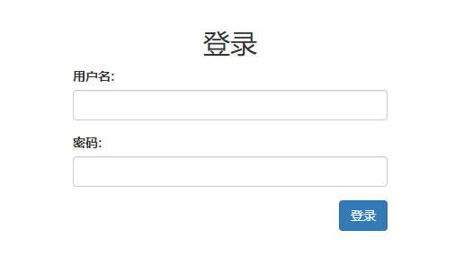
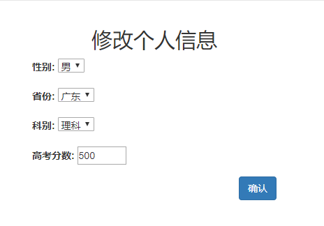
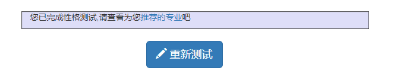
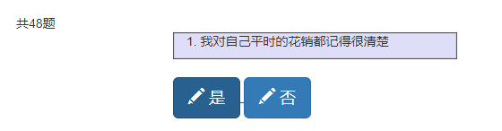
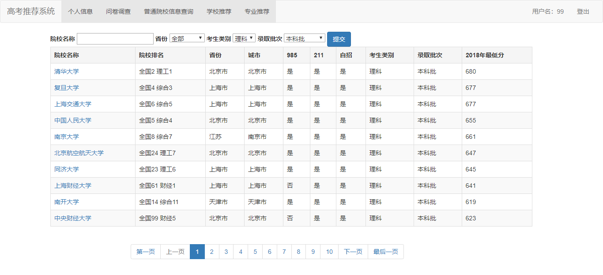
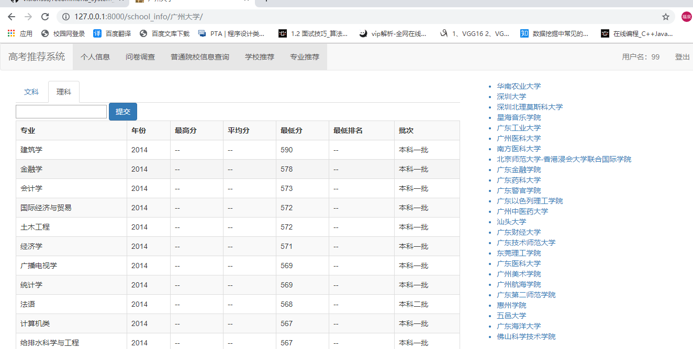
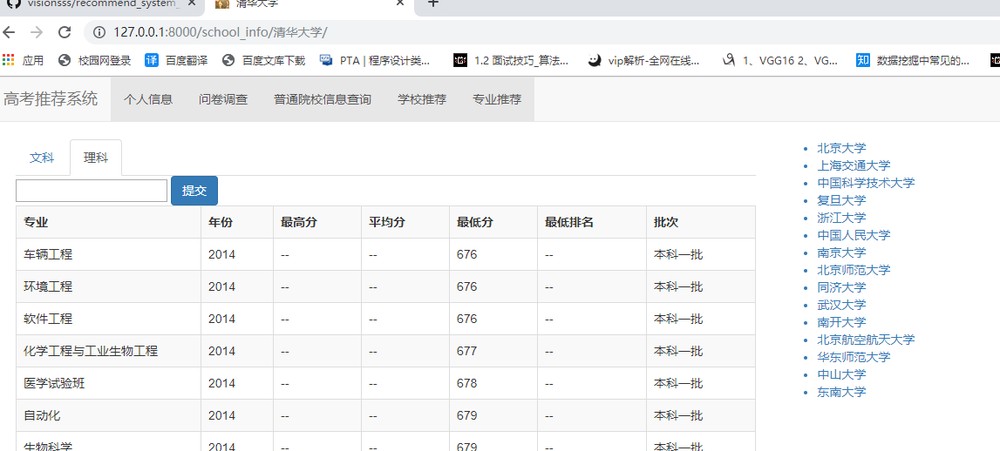
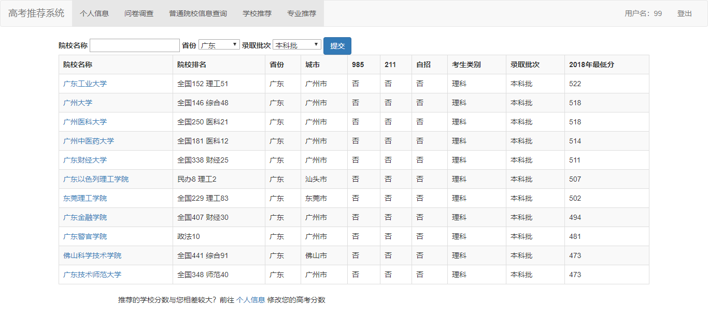
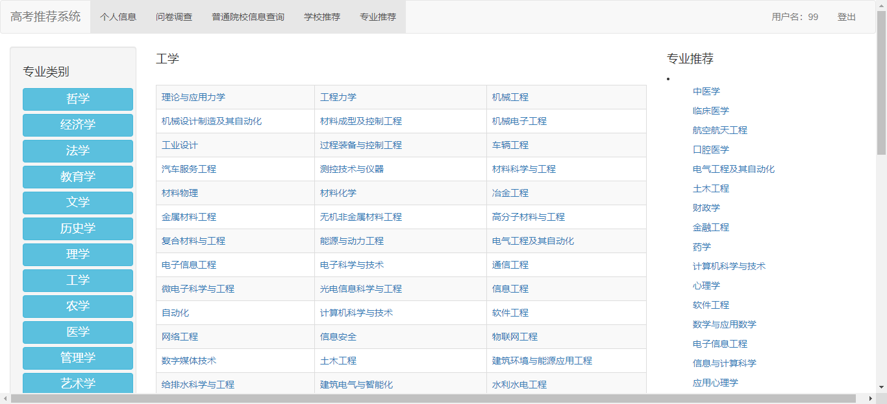

# recommend_system_version2

高考志愿推荐系统

网页效果图

登录注册界面




首页~为了避免首页无东西放，我就放了几张图片


个人信息修改,修改文理科和高考分数后，后续相应的学校推荐会发生改变.



问卷调查/性格测试，根据测试结果，给用户提供相关的专业。

  

 

 学校信息查询。点进每所学校会显示学校相关的信息以及右侧推荐该学校相似度类似的学校。



如果是广东省内的学校就推荐广东省内相似的学校。10(比广州大学评分高)+10(比广州大学评分低)




 如果是广东省外的学校就推荐全国相似的学校。10(比清华大学评分高，可能没有)+10(比广州大学评分低)




学校推荐，根据个人信息的高考分数推荐相关的学校。



根据问卷调查中的人格类型筛选符合的专业，根据专业热度排名，如果点击哲学这一专业后，与哲学相关的专业就会出现在专业推荐的表里面。




Django笔记~写给自己看的，想学去查中文文档。

## recommend_profession

推荐专业

## recommend_school

推荐学校

## recommend_recommend_system

django文件

## school_info

学校信息

## static

存放css、js、bootstrap文件

## templates

存放html文件一般存放base.html，app内的html文件，在app内新建文件夹存放

## Test

性格测试

## user

用户信息、登录注册功能

## Django笔记

pyton manage.py startapp user //创建app

setting.py

```python
STATIC_URL = '/static/'
STATICFILES_DIRS = [
    os.path.join(BASE_DIR, "static"),
]
```

urls.py

```python
from django.contrib import admin
from django.urls import path, include

urlpatterns = [
    path('', include('recommend_profession.urls')),
    path('admin/', admin.site.urls),
]
```

user/urls.py

```python
from django.urls import path
from . import views

urlpatterns = [
    path('', views.index, name='index'),
    path('login/', views.login, name='login'),
]

```

user/views.py

```python
from django.shortcuts import render, redirect
from django.views.decorators.csrf import csrf_exempt    # 取消csrf
from . import forms
from . import models
# Create your views here.


@csrf_exempt
def index(request):
    title = '首页'
    return render(request, 'base.html', locals())

@csrf_exempt
def login(request):
    title = '登录'
    error = ''
    login_form = forms.LoginForm()
    if request.method == 'POST':
        login_form = forms.LoginForm(request.POST)
        if login_form.is_valid():  # 判断是否填写完成
            user = login_form.cleaned_data  # 清理数据
            request.session['is_login'] = True
            request.session['username'] = user['username']
            request.session['school_name'] = ''
            request.session['province'] = ''
            return redirect('/')
        else:
            # 获取全局的error信息,只显示第一个
            if login_form.errors.get('__all__'):
                error = login_form.errors.get('__all__')[0]

    return render(request, 'login.html', locals())
```

user/forms.py

 ```python
from django import forms
from django.core.exceptions import ValidationError
from . import models
class LoginForm(forms.Form):
    # 校验账号密码
    def clean(self):
        username = self.cleaned_data.get('username')
        user = models.User.objects.filter(username=username).first()
        if not user:
            raise ValidationError('该用户名尚未注册')
        else:
            if user.password != self.cleaned_data.get('password'):
                raise ValidationError('密码输入错误')
    username = forms.CharField(label="用户名", max_length=128, widget=forms.TextInput(attrs={'class': 'form-control'}))
    password = forms.CharField(label="密码", max_length=256, widget=forms.PasswordInput(attrs={'class': 'form-control'}))
 ```

user/model.py

```python
from django.db import models


# Create your models here.
class User(models.Model):
    sex_gender = (
        ('male', "男"),
        ('female', "女"),
    )
    province_gender = (
        ('GuangDong', '广东'),
    )
    subject_gender = (
        ('science', '理科'),
        ('art', '文科'),
    )

    username = models.CharField(max_length=128, unique=True)
    password = models.CharField(max_length=256)
    sex = models.CharField(max_length=32, choices=sex_gender, default="male")
    province = models.CharField(max_length=64, choices=province_gender, default="GuangDong")
    subject = models.CharField(max_length=64, choices=subject_gender, default="science")
    score = models.IntegerField(default=0)
    personality_type = models.CharField(max_length=32, default=0)
    c_time = models.DateTimeField(auto_now_add=True)

    def __str__(self):
        return self.username
```

python manage.py makemigrations

python manage.py migrate


